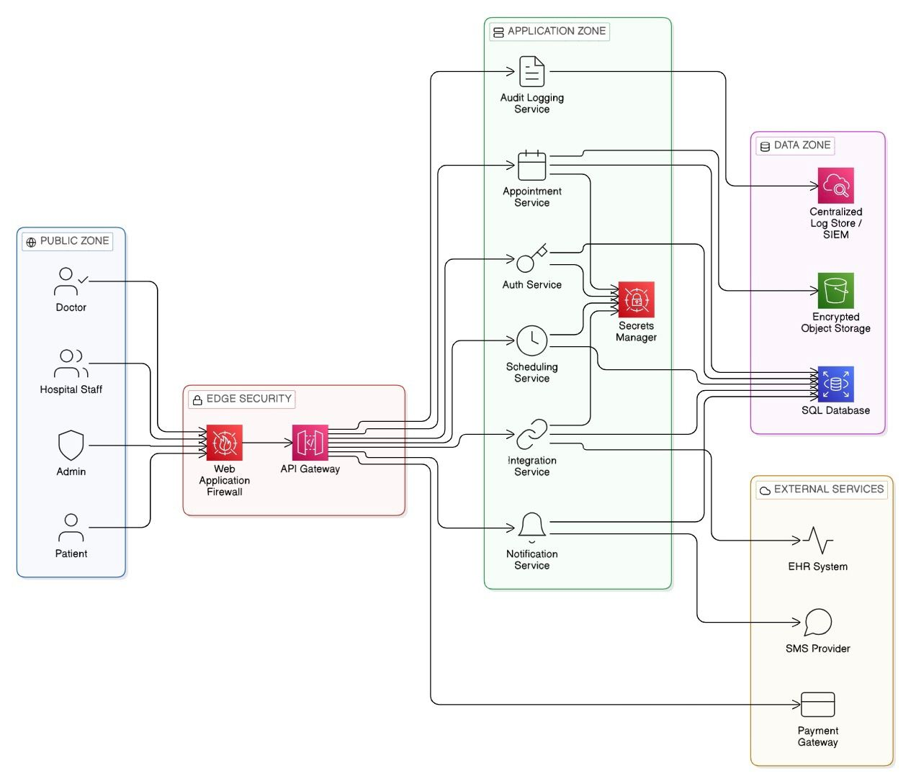

## Task 1 — System Definition and Architecture (Healthcare Appointment System)

This task defines the high-level architecture for a healthcare appointment platform, including its main components, users/roles, and explicit trust boundaries that will be used later for threat modeling.

### 1. Application components

- **Frontend (Portals)**
  - **Patient Portal (Web/Mobile)**: Signup/login, manage profile, search for doctors, book/reschedule/cancel appointments, view upcoming/past visits, view basic messages/notifications, and optionally handle payments for consultations.
  - **Doctor Portal (Web)**: Login, manage availability (working hours, time-off), review and confirm/decline appointment requests, view patient details for their own appointments only (minimum necessary PHI), record brief notes if in scope, and exchange messages with patients or staff.
  - **Hospital/Healthcare Staff Portal (Web)**: Used by receptionists/schedulers to manage doctors, departments, clinic schedules, waiting lists, and resource allocation (rooms, equipment). Allows creating/editing appointments on behalf of patients and running operational reports.
  - **Admin Console (Web)**: Platform administration for one or more hospitals/tenants, global configuration, user and role management, security settings (e.g., MFA policies), and review of audit logs and compliance reports.

- **Backend services (API layer)**
  - **Perimeter / Edge (WAF/CDN/DDoS protection)**: Terminates TLS, filters malicious traffic (OWASP Top 10, bots), protects against volumetric attacks, and optionally serves static assets via CDN.
  - **API Gateway / Backend-for-Frontend (BFF)**: Single entry point for patient/doctor/staff/admin portals. Enforces request validation, rate limiting, authentication/authorization checks for incoming API calls, and routes traffic to internal microservices or modular services.
  - **Auth & Identity Service**: Handles user registration (where allowed), login, MFA, password resets, token/session issuance, and revocation. Manages identity lifecycle for patients, doctors, staff, and admins.
  - **User/Profile Service**: Stores and manages patient and doctor demographic information, contact details, preferences, and linkage to external identifiers (e.g., hospital MRN) where needed.
  - **Availability/Scheduling Service**: Maintains doctor calendars, clinic working hours, time-off, and capacity constraints. Exposes APIs to compute available slots per doctor, location, or specialty.
  - **Appointment Service**: Implements booking logic, conflict checks, double-booking prevention, rescheduling and cancellation rules, and appointment state transitions (requested, confirmed, cancelled, no-show, completed).
  - **Notification Service**: Sends appointment confirmations, reminders, and updates via email/SMS/WhatsApp/push, using templates and localization. Integrates with external providers but centralizes business rules and throttling.
  - **Billing/Payments Service (optional)**: Manages invoices, payment intents, refunds, and reconciliation for paid consultations or telehealth services. Integrates with external payment gateways where required.
  - **Audit Logging Service**: Captures security- and privacy-relevant events (logins, failed logins, role changes, data access to PHI, appointment changes, admin actions) and forwards them to an immutable log store/SIEM.
  - **Integration Service**: Provides connectors to external hospital systems such as EHR/HIS, lab systems, and insurance platforms for syncing patient/doctor identifiers, encounter data, and coverage information.

- **Data storage**
  - **Primary Relational Database**: Stores core transactional entities including users, roles, sessions/tokens metadata, doctor schedules, appointment records, notification status, and (optionally) billing records. Enforces referential integrity and fine-grained access controls.
  - **Secure Object Storage**: Holds documents and attachments such as prescriptions, referrals, lab reports, or uploaded patient documents, subject to least-privilege access and strong encryption controls.
  - **Cache (optional)**: Used for short-lived data like session state, rate-limit counters, frequently queried lookups (e.g., specialties, locations), and computed availability results to improve performance without relaxing authorization checks.
  - **Log Store / SIEM**: Central destination for audit logs, application logs, WAF/CDN logs, and security events, supporting alerting, forensics, and compliance reporting.

### 2. Users and roles

- **External users**
  - **Patient**: Registers/logs in, manages own profile, searches for doctors/clinics, books and manages their own appointments, views their own history and messages, and may upload limited medical or identity documents if allowed.
  - **Doctor**: Logs in to manage availability and clinic schedules, reviews and manages assigned appointments, views patient information strictly for their scheduled encounters, and records basic visit notes where in scope.
  - **Hospital Staff (Receptionist/Scheduler)**: Operates the staff portal to create, modify, or cancel appointments on behalf of patients, manage clinic calendars and resources, handle walk-ins and waitlists, and assist with communications.
  - **System Integrations (Service Accounts)**: Non-human identities used by external systems (EHR/HIS, labs, insurance, notification providers, payment gateways) to call integration APIs or receive webhooks, scoped by least privilege.

- **Internal privileged users**
  - **Admin (Platform Admin)**: Configures tenants/hospitals, manages user accounts and roles, defines security policies (e.g., password/MFA rules), manages integrations and feature flags, and has access to platform-wide configuration and monitoring views.
  - **Security/Compliance Officer (optional)**: Read-only access to detailed audit trails, security dashboards, and compliance reports, but not to modify operational data or bypass business rules.

### 3. Trust boundaries

- **TB1 — Public Internet Boundary (User Devices → WAF/CDN)**  
  Untrusted patient/doctor/staff/admin devices communicate with the platform over the internet. Controls focus on TLS everywhere, HSTS, bot detection, basic input filtering, and protecting against eavesdropping, credential stuffing, phishing-driven login attempts, and generic injection attacks.

- **TB2 — Perimeter to Application Boundary (WAF/API Gateway → Backend Services)**  
  Traffic that passes the edge is forwarded to the API Gateway/BFF and then to internal services. Controls include strict authentication and authorization at the gateway, schema validation, rate limiting and throttling, replay protection for tokens, and segregation of public vs. privileged/admin APIs to limit abuse of backend services.

- **TB3 — Service-to-Data Boundary (Backend Services → Datastores)**  
  Backend services access sensitive datastores such as the primary DB, secure object storage, cache, and log store. Controls include network segmentation, strong IAM/service identities, least-privilege data access policies, encryption in transit and at rest, query parameterization to prevent injection, and detailed logging and monitoring of PHI access.

- **TB4 — Internal Privileged Access Boundary (Admin/Staff Tools → High-Risk Operations)**  
  Admin Console and high-privilege staff interfaces form a distinct boundary because compromise here can impact many patients and providers. Controls emphasize strong MFA, device/posture checks where possible, fine-grained RBAC, just-in-time or least-privilege access, step-up authentication for sensitive actions (e.g., deleting data, changing security settings), and comprehensive, immutable audit logging.

- **TB5 — Third-Party / External Integration Boundary (Platform Services → External Providers)**  
  Integration, Notification, and Billing/Payment services communicate with external providers (EHR/HIS, SMS/email gateways, payment processors). Controls include secure API key and secret management, network egress restrictions, strict data minimization (sharing only necessary PHI), webhook signature verification and anti-replay mechanisms, validation of inbound data, and monitoring for anomalous or failed integrations.

### 4. Architecture diagram

The high-level system and trust boundaries are illustrated in the architecture diagram below:

## Task 2 – Asset Identification and Security Objectives

This task identifies key assets in the Healthcare Appointment System and maps them to core security objectives.

### 1. Critical assets

| Asset ID | Asset Name                 | Description                                                       | Asset Type           | Sensitivity Level |
|---------:|---------------------------|-------------------------------------------------------------------|----------------------|-------------------|
| A1       | User Credentials          | Password hashes, MFA secrets, session and refresh tokens          | Security             | Critical          |
| A2       | Patient Personal Data     | Name, national ID/passport, DOB, gender, contact details          | Personal (PII)       | Critical          |
| A3       | Medical/Health Data       | Appointment reason, symptoms, prescriptions, reports              | PHI                  | Critical          |
| A4       | Appointment Records       | Date, doctor, clinic, status, booking metadata                    | Operational + PHI    | High              |
| A5       | Doctor Data               | Professional details, availability schedule                       | Personal/Operational | High              |
| A6       | Payment Records           | Transaction IDs, billing status, payment tokens                   | Financial            | High              |
| A7       | Business Logic            | Booking rules, conflict checks, authorization decisions           | Application Logic    | Critical          |
| A8       | API Keys & Service Creds  | Keys for SMS, payment, EHR/HIS, and other integrations            | Security             | Critical          |
| A9       | Audit Logs                | Records of access, changes, and admin activity                    | Compliance/Security  | Critical          |
| A10      | Database                  | Primary relational database storing system data                   | Infrastructure       | Critical          |
| A11      | Object Storage            | Uploaded documents (reports, referrals, attachments)              | PHI Storage          | Critical          |
| A12      | Admin Accounts            | Platform administrator identities and privileges                   | Security             | Critical          |

### 2. Security objectives

The system focuses on four main security objectives:

- **Confidentiality**: Only authorized people and services can view sensitive healthcare, identity, and financial data.
- **Integrity**: Medical data, schedules, billing information, and audit logs cannot be changed without proper authorization.
- **Availability**: Portals and APIs must be reliably available so patients and staff can book and manage care.
- **Accountability**: All important actions are traceable to authenticated identities via tamper-resistant audit logs and RBAC.

### 3. Asset–objective mapping

| Asset ID | Confidentiality | Integrity | Availability | Accountability |
|---------:|:---------------:|:--------:|:-----------:|:--------------:|
| A1       | ✓               | ✓        | ✓           | ✓              |
| A2       | ✓               | ✓        | ✓           | ✓              |
| A3       | ✓               | ✓        | ✓           | ✓              |
| A4       | ✓               | ✓        | ✓           | ✓              |
| A5       | ✓               | ✓        | ✓           | ✓              |
| A6       | ✓               | ✓        | ✓           | ✓              |
| A7       |                 | ✓        | ✓           | ✓              |
| A8       | ✓               | ✓        | ✓           | ✓              |
| A9       | ✓               | ✓        | ✓           | ✓              |
| A10      | ✓               | ✓        | ✓           | ✓              |
| A11      | ✓               | ✓        | ✓           | ✓              |
| A12      | ✓               | ✓        | ✓           | ✓              |

In summary, the most security-sensitive assets are credentials, PHI, core business logic, audit logs, and administrative access; they drive strong requirements for confidentiality, integrity, high availability of booking services, and robust accountability for compliance and forensics.

## Task 3 – Threat Modeling (STRIDE)

This task applies STRIDE-based threat modeling to the Healthcare Appointment System, focusing on authentication, authorization, data storage, API communication, logging/monitoring, and administrative access.

### 1. Modeling approach

After constructing a Data Flow Diagram (DFD) with defined trust boundaries in Microsoft Threat Modeling Tool 2016, the built-in STRIDE engine was used to automatically generate **134 threats** across processes, data flows, data stores, and external entities.  
Low-level OS/runtime threats (e.g., memory or thread tampering), generic infrastructure items, and repetitive entries were filtered out, and near-duplicates were consolidated into representative threats.  
The remaining threats were checked to ensure coverage of **authentication, authorization, data storage, API communication, logging and monitoring, and administrative access**, then each was assigned a **High** or **Medium** risk based on impact to PHI, system integrity, availability, and privilege escalation.  
This structured refinement reduced the initial list to **18 realistic, application-layer threats** aligned with the defined trust boundaries.

The DFD and trust boundaries are shown in the following diagram:

### 2. STRIDE threat summary table

| Threat ID | Description                                                                   | STRIDE                 | Affected Component                | Impact                                    | Risk Level | Risk Reasoning                                       |
| --------- | ----------------------------------------------------------------------------- | ---------------------- | --------------------------------- | ----------------------------------------- | ---------- | ---------------------------------------------------- |
| T1        | Attacker performs credential stuffing on patient login endpoint               | Spoofing               | Auth Service                      | Unauthorized access to PHI                | High       | Internet-facing login + sensitive healthcare data   |
| T2        | Replay of authentication token to bypass session controls                     | Elevation of Privilege | API Gateway                       | Account takeover                          | High       | Token reuse compromises identity trust              |
| T3        | Broken access control allows patient to view another patient’s records (IDOR) | Elevation of Privilege | Appointment Service               | PHI exposure                              | High       | Direct violation of confidentiality and compliance  |
| T4        | Admin account spoofing via phishing or credential theft                       | Spoofing               | Admin Console                     | Full system compromise                    | High       | Admin privileges affect entire system               |
| T5        | SQL injection alters appointment records                                      | Tampering              | Primary Database                  | Data corruption, appointment manipulation | High       | Direct impact on medical scheduling integrity       |
| T6        | Unauthorized modification of doctor availability                              | Tampering              | Scheduling Service                | Service disruption, incorrect bookings    | Medium     | Impacts operations but limited to scheduling        |
| T7        | Sensitive medical data exposed due to improper encryption in transit          | Information Disclosure | API Communication                 | PHI leakage                               | High       | Healthcare data is highly regulated                 |
| T8        | Man-in-the-middle attack intercepts login credentials                         | Information Disclosure | API Gateway                       | Credential compromise                     | High       | Occurs at Internet trust boundary                   |
| T9        | Denial-of-Service attack overwhelms API Gateway                               | Denial of Service      | API Gateway                       | System unavailable                        | High       | Prevents appointment booking and hospital operations |
| T10       | Database unavailability due to resource exhaustion                            | Denial of Service      | SQL Database                      | Loss of appointment access                | High       | Core system dependency                              |
| T11       | Object storage misconfiguration exposes medical reports publicly              | Information Disclosure | Cloud Storage                     | PHI breach                                | High       | Sensitive uploaded documents exposed                |
| T12       | Audit logs deleted or tampered after malicious admin action                   | Repudiation            | Audit Logging Service             | No forensic traceability                  | Medium-High| Impacts accountability and compliance               |
| T13       | Insufficient logging prevents detection of unauthorized access                | Repudiation            | Audit Logging Service             | Delayed incident response                 | Medium     | Reduces detection capability                        |
| T14       | API request tampering modifies appointment data in transit                    | Tampering              | API Gateway / Appointment Service | Data integrity compromise                 | High       | Impacts booking correctness                         |
| T15       | Unauthorized service-to-service access within application zone                | Elevation of Privilege | Internal Services                 | Privilege escalation                      | Medium-High| Internal compromise spreads laterally               |
| T16       | External Payment Gateway spoofing sends false payment confirmation            | Spoofing               | Integration Service               | Financial inconsistency                   | Medium     | Financial impact but limited scope                  |
| T17       | SMS Provider spoofing causes fake notifications                               | Spoofing               | Notification Service              | User confusion / phishing risk            | Medium     | Operational + reputational risk                     |
| T18       | Admin privilege escalation from hospital staff role                           | Elevation of Privilege | Authorization Logic               | Full admin-level access                   | High       | Compromises system governance                       |

These threats collectively cover the required areas (authentication, authorization, data storage, API communication, logging/monitoring, and administrative access) with clear components, impacts, and risk levels.

## Task 4 – Security Controls and Architecture Hardening

This task documents the key security controls added to mitigate the highest-value threats identified in Task 3.

### 1. Control categories (short justification)

1. **Identity and Access Management (IAM)**  
   Centralized authentication via an Auth Service using token-based authentication (e.g., JWT) and **RBAC**. **MFA is enforced for administrative accounts** to reduce account compromise and privilege escalation.

2. **Network Segmentation**  
   The architecture is separated into **Public Zone**, **Application Private Zone**, and an isolated **Secure Data Zone**. Only the **API Gateway** is internet-facing; backend services and datastores remain private to reduce attack surface and prevent direct database exposure.

3. **Data Protection**  
   **TLS** is used for data in transit. The SQL database and object storage use **encryption at rest** to protect stored PHI and preserve confidentiality and integrity.

4. **Secrets Management**  
   A centralized **Secrets Manager** stores database credentials, API keys, and integration secrets. Secrets are not hardcoded in services, reducing credential leakage risk and enabling safe rotation.

5. **Monitoring and Logging**  
   Services send logs to a centralized **Audit Logging Service**, which forwards to a secure **log store/SIEM**. This supports detection of suspicious activity, accountability, and reduces repudiation risk.

6. **Secure Deployment Practices**  
   Separation of environments (dev/staging/prod) and controlled administrative access. Infrastructure is deployed using secure configuration management and **least-privilege** policies to reduce misconfiguration and insider risk.

### 2. What changed from the original diagram

Added:
- Web Application Firewall (WAF)
- Secrets Manager
- Log Store / SIEM
- Clear Public / Application / Data segmentation
- Isolated Secure Data Zone
- Centralized Audit Logging
- Defense-in-depth layers

### 3. Why this architecture is strong

- Defense-in-depth (multiple protection layers)
- Trust boundary enforcement
- Admin plane separated from user plane
- Sensitive data isolated
- Secrets centrally managed
- Monitoring built-in
- Reduced attack surface

## Task 5 – Risk Treatment and Residual Risk

Following structured threat modeling and secure architecture design, each **High** and **Medium** risk threat was evaluated to determine the best treatment strategy. Decisions were based on PHI impact, operational continuity, regulatory exposure, and feasibility of mitigation.

### 1. Risk treatment strategies

- **Mitigate**: Reduce risk through architectural/security controls.
- **Transfer**: Shift risk to a third-party provider (e.g., payment processor).
- **Accept**: Risk remains at a tolerable level.
- **Avoid**: Eliminate risky functionality (not required in this system).

### 2. Treatment decisions and residual risk

| Threat ID | Threat Summary                      | Risk Level  | Treatment Decision | Mitigation Strategy                                 | Residual Risk                                |
| --------- | ----------------------------------- | ----------- | ------------------ | --------------------------------------------------- | -------------------------------------------- |
| T1        | Credential stuffing on login        | High        | Mitigate           | MFA, rate limiting, account lockout, monitoring     | Low – social engineering still possible      |
| T2        | Token replay attack                 | High        | Mitigate           | Short-lived JWTs, token validation, TLS             | Low – stolen valid token usable briefly      |
| T3        | Broken access control (IDOR)        | High        | Mitigate           | RBAC, server-side authorization checks              | Low – logic misconfiguration possible        |
| T4        | Admin account spoofing              | High        | Mitigate           | Admin MFA, separate admin plane, IP restrictions    | Medium – phishing risk remains               |
| T5        | SQL injection                       | High        | Mitigate           | Input validation, WAF, parameterized queries        | Low – zero-day vulnerabilities possible      |
| T6        | Doctor availability tampering       | Medium      | Mitigate           | Authorization enforcement, audit logging            | Low                                          |
| T7        | PHI exposure in transit             | High        | Mitigate           | Enforce TLS 1.2+, HSTS                              | Very Low                                     |
| T8        | MITM interception of credentials    | High        | Mitigate           | TLS, certificate validation                         | Very Low                                     |
| T9        | API Gateway DoS                     | High        | Mitigate           | Rate limiting, autoscaling, DDoS protection         | Medium – large-scale attacks possible        |
| T10       | Database unavailability             | High        | Mitigate           | Replication, backups, monitoring                    | Medium – infrastructure failure risk remains |
| T11       | Public exposure of object storage   | High        | Mitigate           | Private bucket policies, encryption, access control | Low – misconfiguration risk remains          |
| T12       | Audit log tampering                 | Medium-High | Mitigate           | Immutable log storage, restricted access            | Low                                          |
| T13       | Insufficient logging                | Medium      | Mitigate           | Centralized logging, alerting, SIEM                 | Low                                          |
| T14       | API request tampering               | High        | Mitigate           | TLS, request validation, integrity checks           | Low                                          |
| T15       | Internal privilege escalation       | Medium-High | Mitigate           | Least privilege, service isolation                  | Medium – insider risk persists               |
| T16       | Payment gateway spoofing            | Medium      | Transfer           | Use PCI-compliant trusted gateway                   | Low – third-party breach risk                |
| T17       | SMS provider spoofing               | Medium      | Transfer           | Signed webhook validation                           | Low                                          |
| T18       | Staff privilege escalation to admin | High        | Mitigate           | RBAC, separation of duties, audit monitoring        | Low–Medium                                   |

### 3. Residual risk explanation (brief)

Even with defense-in-depth controls, some residual risks remain:

- **Human-based risks**: phishing/social engineering can still lead to credential compromise even with MFA.
- **Large-scale DoS**: extreme distributed attacks may temporarily impact availability despite DDoS protection and scaling.
- **Misconfiguration**: storage/IAM or deployment configuration mistakes can reintroduce exposure.
- **Third-party dependency**: transferred risks (payment/SMS) depend on provider security posture.
- **Insider threats**: privileged misuse remains possible, but is reduced through least privilege and strong auditing.

Overall, the layered architecture (segmentation, encryption, IAM/RBAC/MFA, secrets management, and centralized logging/SIEM) reduces residual risk to levels consistent with healthcare security expectations.
