## DVWA Security Lab Report

Here's a concise **Environment Setup Description** you can place right after your lab heading:

---

## Environment Setup Description

The Damn Vulnerable Web Application (DVWA) was deployed using Docker containerization technology to create an isolated and reproducible testing environment. The setup followed these specifications:

### Lab Environment Configuration

| Component | Specification |
|-----------|---------------|
| **Platform** | Docker Container |
| **Base Image** | vulnerables/web-dvwa |
| **Host Access** | http://localhost:8080 |
| **Default Credentials** | admin / password |

### Deployment Process

The DVWA environment was initialized using the following Docker command:

```bash
docker run -d -p 8080:80 --name dvwa vulnerables/web-dvwa
```

This command:
- Pulls the official DVWA Docker image
- Maps port `8080` on the host to port `80` inside the container
- Creates an isolated container named `dvwa`
- Runs the container in detached mode (`-d`)

### Environment Verification

After deployment, the following steps were performed to verify proper configuration:

1. **Container Status Check**
   ```bash
   docker ps
   ```
   Confirmed the container was running with the correct port mapping.

2. **Database Setup**
   - Navigated to `http://localhost:8080/setup.php`
   - Clicked "Create/Reset Database" to initialize the MySQL database
   - Verified all tables were created successfully

3. **Security Level Configuration**
   - Logged into DVWA using default credentials (`admin/password`)
   - Accessed the DVWA Security page
   - Systematically tested each vulnerability at Low, Medium, and High security levels

This controlled lab environment provided a safe and isolated platform for understanding real-world web application vulnerabilities without risking production systems.

### Vulnerability 1: Command Injection
**Module:** Command Injection

#### Low Security Level
- **Payload Used:**

```text
127.0.0.1; cat /etc/passwd
```
- **Result:** Successfully executed `ping` on `127.0.0.1` and then displayed the contents of `/etc/passwd` (e.g., `root:x:0:0:root:/root:/bin/bash`, `daemon:x:1:1:daemon:/usr/sbin/nologin`, `mysql:x:101:101:MySQL Server...`).
- 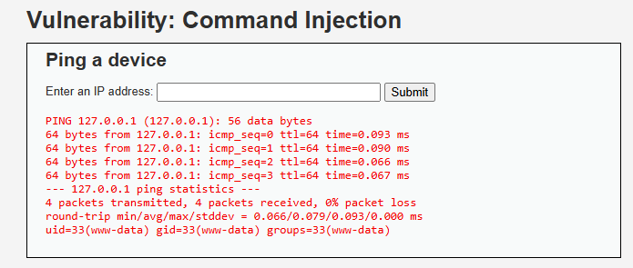
- **Explanation of why it worked:** 
  - No input sanitization or validation on the `ip` parameter
  - User input is directly concatenated into the system command (similar to `system("ping -c 4 $target");`)
  - The `;` character tells the shell to execute a second command, so `cat /etc/passwd` runs after `ping`
  - This allows arbitrary commands to be executed on the server (real RCE)

#### Medium Security Level
- **Payload Used:**

```text
127.0.0.1; cat /etc/passwd
```
- **Result:** Only the `ping 127.0.0.1` output is shown; no `/etc/passwd` contents are displayed.
- 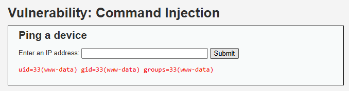
- **Explanation of why it failed:**
  - Medium security filters or escapes dangerous shell metacharacters like `;`, `&&`, `|`, and `` ` ``
  - DVWA likely uses simple replacement (e.g., `str_replace(';', '', $target)`) or `escapeshellcmd()` on the input
  - The payload is transformed into something like `127.0.0.1 cat /etc/passwd`, which is treated as an invalid argument rather than a second command
  - As a result, only the intended `ping` command runs and the injected command is neutralized

#### High Security Level
- **Payload Used:** Various injection attempts such as `127.0.0.1; cat /etc/passwd`, `127.0.0.1 && ls`, etc.
- **Result:** Input that contains anything other than numbers and dots is rejected or sanitized so that only a valid IP (e.g., `127.0.0.1`) is ever sent to the system command; only normal `ping` output is shown.
- 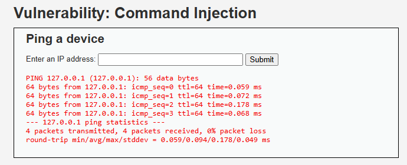
- **Explanation of why it failed:**
  - High security applies strict input validation, typically using a regex like `preg_match("/^[0-9\.]+$/", $target)`
  - The input must consist only of digits and dots (valid IP format), so any attempt to add shell metacharacters is blocked
  - Because invalid input never reaches the `system()` call, there is no opportunity to inject extra commands

### Vulnerability 2: File Inclusion (LFI)
**Module:** File Inclusion (Local File Inclusion – LFI)

#### Low Security Level
- **Payload Used:**

```text
?page=../../../../etc/passwd
```
- **Result:** The contents of the `/etc/passwd` system file were displayed on the webpage, confirming that the application allowed directory traversal and inclusion of sensitive system files outside the intended directory.
- 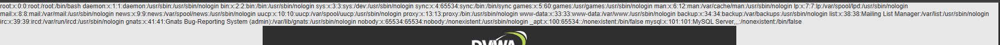
- **Explanation of why it worked:**
  - At Low security, the application directly uses the `page` parameter in an `include()` call without validation or sanitization
  - Directory traversal sequences like `../../../../` allow navigation outside the web root/application directory
  - This lets the attacker include and display arbitrary files on the server, such as `/etc/passwd`, demonstrating a Local File Inclusion vulnerability

#### Medium Security Level
- **Payload Used:**

```text
?page=../../../../etc/passwd
```
- **Result:** The attack failed and the application returned an error such as: `ERROR: File not found!`
- 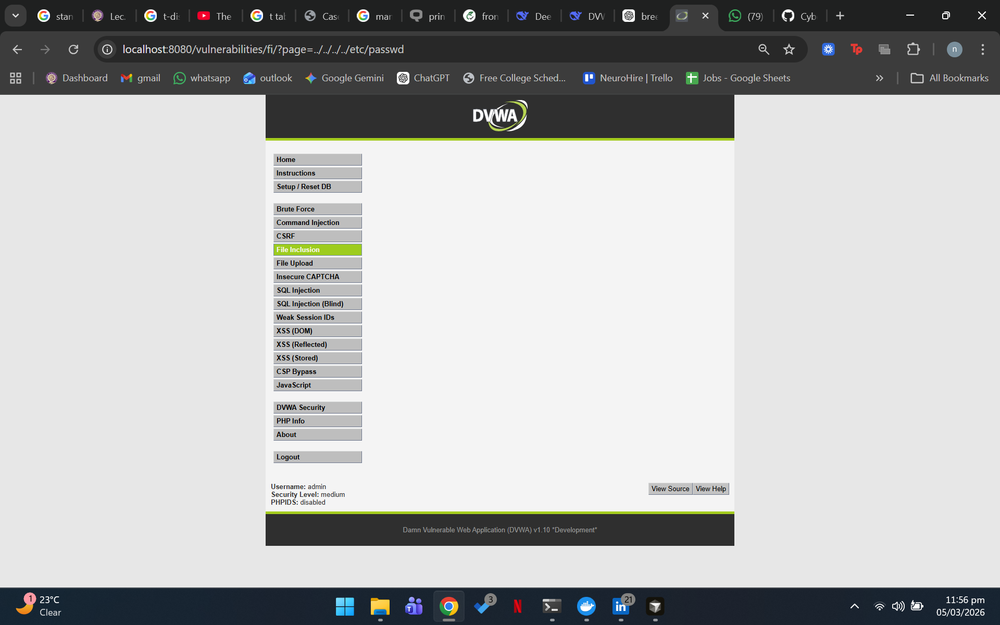
- **Explanation of why it failed:**
  - At Medium security, DVWA applies basic input filtering to block directory traversal attempts
  - The application removes or sanitizes `../` sequences from the `page` parameter before including the file
  - This filtering breaks the traversal path so `/etc/passwd` cannot be located, resulting in the “File not found” error
  - While this mitigates straightforward attacks, it relies on simple string filtering that might be bypassed with encoding or obfuscation

#### High Security Level
- **Payload Used:**

```text
?page=../../../../etc/passwd
```
- **Result:** The attack was fully blocked; only predefined files within the application directory could be accessed, and `/etc/passwd` was never included.
- 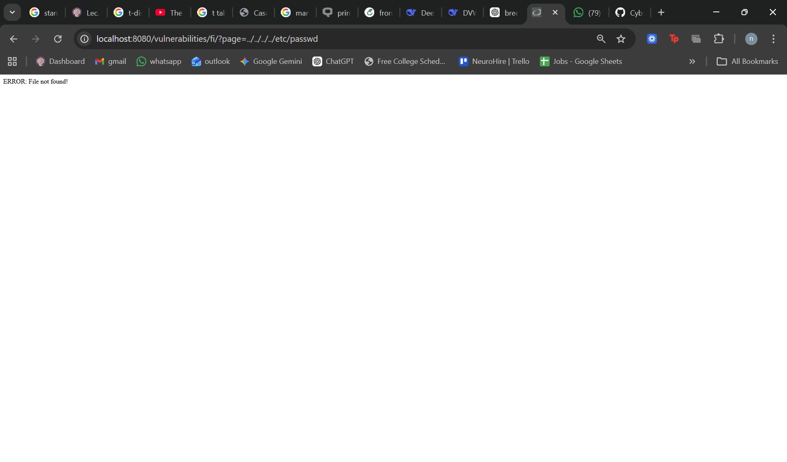
- **Explanation of why it failed:**
  - At High security, the application restricts file inclusion to a whitelist of allowed pages
  - Instead of directly passing user input to `include()`, it checks whether the requested `page` value is in the allowed list
  - Since `/etc/passwd` (and traversal paths to it) are not on this list, the inclusion attempt is blocked
  - This effectively mitigates the Local File Inclusion vulnerability by design, rather than relying on fragile string filtering

### Vulnerability 3: SQL Injection
**Module:** SQL Injection

#### Low Security Level
- **Payload Used:**

```text
1' OR '1'='1
```
- **Result:** The query returned multiple user records including `admin`, `Gordon Brown`, `Hack Me`, `Pablo Picasso`, and `Bob Smith`, showing that all rows in the `users` table were retrieved.
- 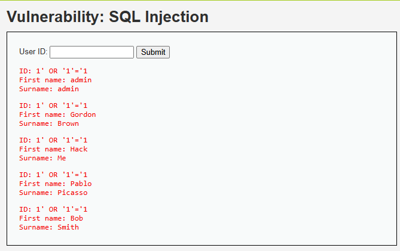
- **Explanation (why it worked):**
  - At Low security, the user input is inserted directly into the SQL query without validation or sanitization.
  - The backend query is similar to:  
    `SELECT first_name, last_name FROM users WHERE user_id = '$id';`
  - With the payload, the query becomes:  
    `SELECT first_name, last_name FROM users WHERE user_id='1' OR '1'='1';`
  - Because `'1'='1'` is always true, the condition matches every row, so the database returns all user records (classic SQL Injection).

#### Medium Security Level
- **Payload Used:**

```text
1
```
- **Result:** Only the record for user ID `1` (admin) is returned; the injection attempt does not execute.
- 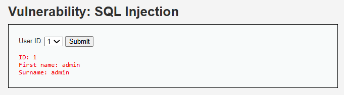
- **Explanation (why the attack was limited):**
  - Medium security applies basic input sanitization (e.g., `mysqli_real_escape_string()`), escaping special characters such as quotes.
  - Because the dangerous characters needed to break out of the query are escaped, the SQL statement stays syntactically correct and behaves as intended.
  - As a result, the application simply runs the normal query and returns the single matching row for `user_id = 1`.

#### High Security Level
- **Payload Used:**

```text
1' OR '1'='1
```
- **Result:** The injection attempt fails and only legitimate user data is returned. The interface also requires the ID to be chosen from a controlled input rather than free text.
- 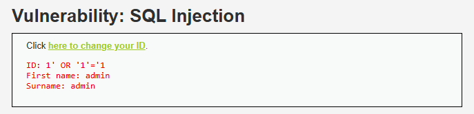
- **Explanation (why it failed):**
  - At High security, stronger defenses are in place, such as restricting user input to a fixed list or enforcing strict server-side validation.
  - In many hardened implementations, prepared statements or parameterized queries are used so user input cannot change the structure of the SQL command.
  - Because of these controls, the injected condition cannot be appended to the SQL query, preventing the SQL Injection attack.

### Vulnerability 4: Cross-Site Request Forgery (CSRF)
**Module:** CSRF

#### Low Security Level
- **Payload Used:**

```text
/vulnerabilities/csrf/?password_new=password123&password_conf=password123&Change=Change
```
- **Result:** The admin password was successfully changed and the message **“Password Changed.”** appeared.
- 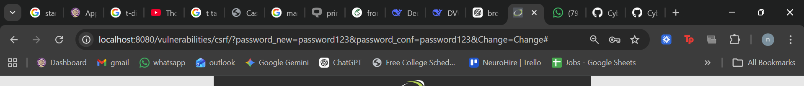
- **Explanation (why it worked):**
  - At Low security, there is no CSRF protection; the password change is accepted purely based on the session cookie.
  - The application processes a state-changing GET request without checking the origin, referrer, or any CSRF token.
  - An attacker could embed this URL in a malicious page; when a logged-in victim visits it, their browser sends the request and silently changes the password.

#### Medium Security Level
- **Payload Used:**

```text
/vulnerabilities/csrf/?password_new=password123&password_conf=password123&Change=Change
```
- **Result:** The password change succeeds when the request is sent directly from the DVWA page.
- 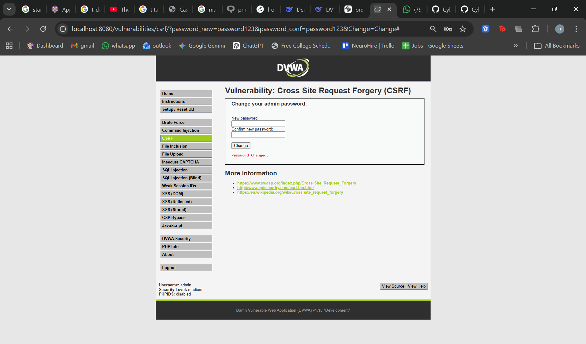
- **Explanation (why the attack was limited):**
  - Medium security introduces a basic defense by checking the HTTP `Referer` header to confirm that the request originates from the DVWA application.
  - Requests initiated from the DVWA form include a valid `Referer`, so the password change is allowed.
  - However, this is a weak control because the `Referer` header can be removed or forged, meaning CSRF attacks may still be possible.

#### High Security Level
- **Payload Used:**

```text
/vulnerabilities/csrf/?password_new=password123&password_conf=password123&Change=Change
```
- **Result:** The password change request fails unless a valid CSRF token is included.
- 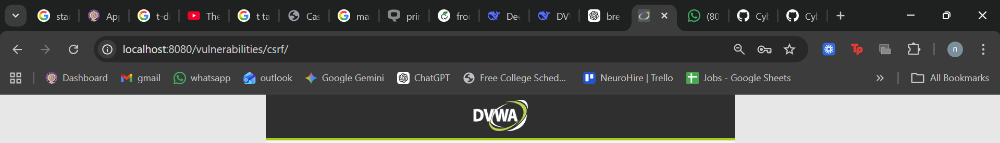
- **Explanation (why it failed):**
  - At High security, DVWA uses a per-request CSRF token embedded in the password change form.
  - The server verifies that the submitted token matches the one stored for the user’s session before applying the change.
  - Because an attacker cannot reliably guess or obtain this token, forged cross-site requests are rejected, effectively preventing CSRF.

### Vulnerability 5: File Upload
**Module:** File Upload

#### Low Security Level
- **Payload Used:**

```php
<?php echo "File upload vulnerability exploited!"; ?>
```
- **Result:** The malicious PHP file was successfully uploaded and executed from the server directory, demonstrating remote code execution.
- 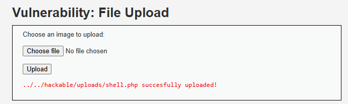
- **Explanation (why it worked):**
  - At Low security, the application does **not** validate file types or extensions.
  - The server accepts `.php` files and stores them in a web-accessible uploads directory.
  - When the uploaded script is accessed via the browser, the server executes the PHP code, giving the attacker remote code execution.

#### Medium Security Level
- **Payload Used:**

```text
shell.php.jpg
```
- **Result:** The file upload was accepted and stored in the server uploads directory.
- 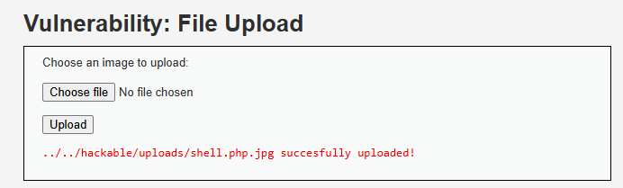
- **Explanation (why the attack still works):**
  - Medium security introduces simple extension checks, but only inspects the **last** extension in the filename.
  - By renaming the payload to `shell.php.jpg`, the application treats it as an image while the content is still PHP.
  - If the server is misconfigured (for example, interprets `.php` inside double extensions), the attacker may still achieve code execution despite the filter.

#### High Security Level
- **Payload Used:**

```text
shell.php
```
- **Result:** The upload attempt was rejected; only legitimate image files are accepted.
- 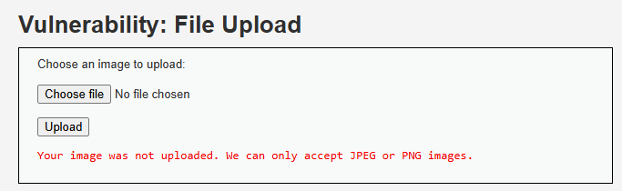
- **Explanation (why it failed):**
  - High security enforces stricter checks on both file extension and content (MIME type).
  - Only specific image formats (such as `.jpg` and `.png`) are allowed, and files containing PHP code are rejected.
  - This prevents attackers from uploading executable scripts and blocks this path to remote code execution.

### Vulnerability 6: SQL Injection (Blind)
**Module:** SQL Injection (Blind)

#### Low Security Level
- **Payload Used:**

```text
1' AND 1=1 #
```
- **Result:** The application returned the message **“User ID exists in the database.”**, confirming that the injected condition evaluated to true.
- 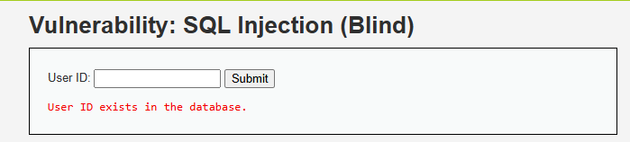
- **Explanation (why it worked):**
  - At Low security, user input is inserted directly into the SQL query without validation or sanitization.
  - By adding a logical condition such as `1' AND 1=1 #`, the attacker can influence the `WHERE` clause and observe whether the application reports success or failure.
  - Even though no raw database results are shown, differences in the application’s message reveal whether the injected condition is true or false, enabling **Blind SQL Injection**.

#### Medium Security Level
- **Payload Used:**

```text
1
```
- **Result:** The application returns “User ID exists in the database.” only for valid IDs chosen via the interface.
- 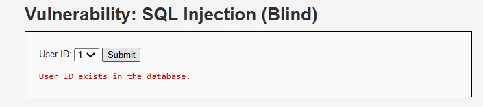
- **Explanation (why the attack was limited):**
  - Medium security constrains input using form controls (such as a dropdown) and applies basic sanitization.
  - Because the user cannot freely type arbitrary payloads, it is much harder to inject additional SQL operators or comments.
  - As a result, the query behaves as intended and Blind SQL Injection is largely mitigated at this level.

#### High Security Level
- **Payload Used:**

```text
1
```
- **Result:** The page still reports “User ID exists in the database.” for valid selections, but the underlying query cannot be manipulated.
- 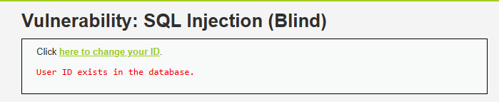
- **Explanation (why it failed):**
  - High security combines strict input handling with stronger server-side protections (for example, parameterized queries).
  - The ID is taken only from controlled UI elements and bound as a parameter, so additional SQL operators cannot be injected.
  - This design prevents attackers from influencing the query logic, effectively mitigating Blind SQL Injection.

### Vulnerability 7: Weak Session IDs
**Module:** Weak Session IDs

#### Low Security Level
- **Payload Used:** Click the **Generate** button on the Weak Session IDs page to create new session cookies.
- **Result:** The generated session IDs appear as simple sequential numbers such as:  
  - `dvwaSession = 1`  
  - `dvwaSession = 2`  
  - `dvwaSession = 3`
- 
- **Explanation (why it worked):**
  - At the Low security level, the application generates session identifiers using sequential numeric values.
  - Since these values follow a clear pattern, attackers can easily predict the next valid session ID and potentially hijack another user’s session.
- **Why this fails at higher levels:**
  - At higher security levels, the application attempts to make session IDs less predictable by deriving them from timestamps instead of simple increments, removing the obvious sequential pattern used at Low.

#### Medium Security Level
- **Payload Used:** Click the **Generate** button to create new session cookies.
- **Result:** Session identifiers appear as large numeric values related to timestamps, for example:  
  - `dvwaSession = 1772742600`
- 
- **Explanation (why it worked):**
  - At the Medium security level, session IDs are generated using timestamp-based values.
  - Although this approach removes the simple sequential pattern, the identifiers are still predictable because they are based on the current time; an attacker could estimate when the session was created and guess nearby values.
- **Why this fails at higher levels:**
  - At the High security level, the application continues to obscure session generation slightly, making prediction less straightforward than at Medium, but still not truly random.

#### High Security Level
- **Payload Used:** Click the **Generate** button to generate session cookies.
- **Result:** Session IDs still appear as numeric values similar to timestamps, for example:  
  - `dvwaSession = 1772742648`
- 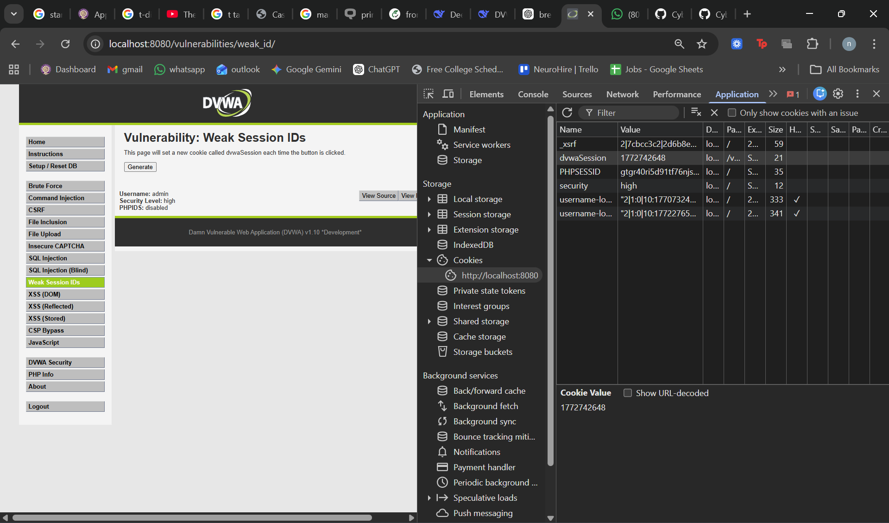
- **Explanation (why it worked):**
  - Even at the High security level in DVWA, session identifiers are derived from time-based values.
  - Because timestamps can be approximated within a small time window, attackers may still attempt to guess nearby session IDs.
- **Why this is still weaker than a secure implementation:**
  - Compared with Low, timestamp-based values make prediction less trivial, but they remain guessable.
  - A secure real-world implementation would use cryptographically strong, random session identifiers rather than predictable numeric values.

### Vulnerability 8: DOM Based Cross Site Scripting (XSS)
**Module:** DOM-Based XSS

#### Low Security Level
- **Payload Used:**

```html
<script>alert('XSS')</script>
```
- **Result:** JavaScript executed and an alert popup with **“XSS”** appeared in the browser.
- 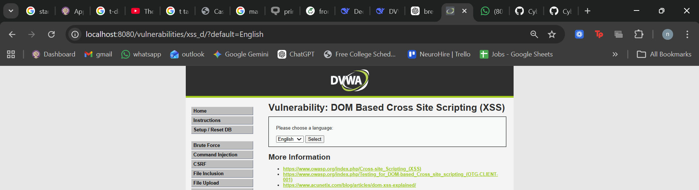
- **Explanation (why it worked):**
  - At Low security, the application reads the `default` parameter from the URL and writes it into the page using JavaScript without validation or sanitization.
  - Because this untrusted value is inserted directly into the DOM, the injected `<script>` tag executes in the victim’s browser.
  - This allows arbitrary JavaScript execution and demonstrates a DOM-based XSS vulnerability.

#### Medium Security Level
- **Payload Used:**

```html
<script>alert('XSS')</script>
```
- **Result:** The payload did not execute and no alert appeared; the page loaded normally.
- 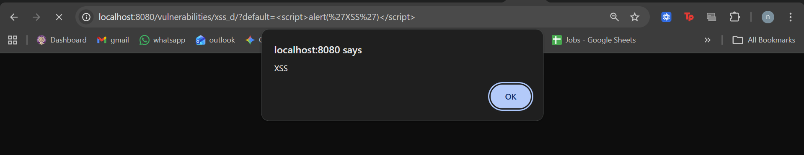
- **Explanation (why it failed):**
  - Medium security introduces simple input filtering and restricts the allowed values for the `default` parameter (typically limiting it to predefined language options).
  - Because only known-safe values are accepted, injected script tags are rejected and never written into the DOM.
  - This prevents the malicious JavaScript from running in the browser.

#### High Security Level
- **Payload Used:**

```html
<script>alert('XSS')</script>
```
- **Result:** The payload did not execute and the page remained unchanged.
- 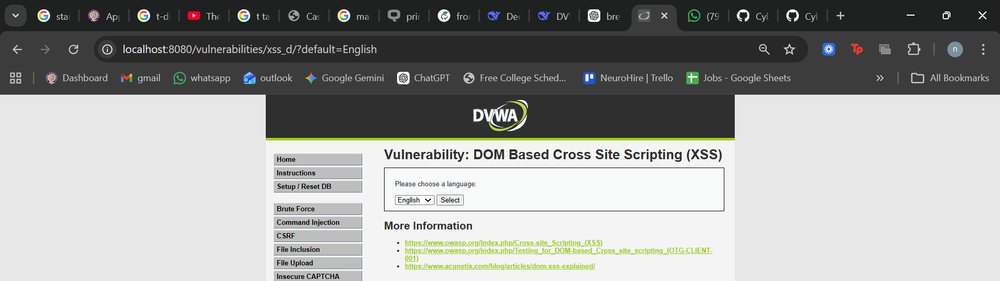
- **Explanation (why it failed):**
  - At High security, stronger validation is applied to the `default` parameter and only legitimate values are processed.
  - The application avoids inserting untrusted data into dangerous JavaScript sinks, effectively blocking DOM-based XSS.
  - As a result, attempts to inject script code via the URL parameter are neutralized.

### Vulnerability 9: Reflected Cross Site Scripting (XSS)
**Module:** Reflected XSS

#### Low Security Level
- **Payload Used:**

```html
<script>alert('XSS')</script>
```
- **Result:** A JavaScript alert popup appeared in the browser.
- 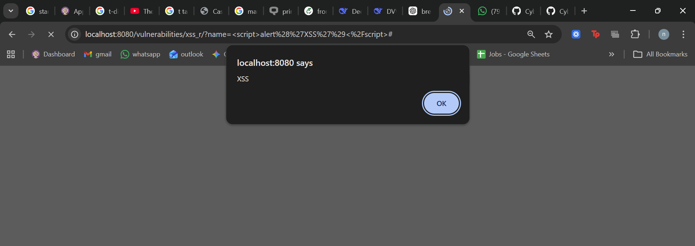
- **Explanation (why it worked):**
  - At Low security, user input from the name parameter is reflected directly into the webpage without sanitization.
  - The browser receives the injected `<script>` tag as part of the HTML and executes it.
  - This demonstrates a classic Reflected XSS vulnerability where attacker-controlled input is echoed back and interpreted as code.

#### Medium Security Level
- **Payload Used:**

```html

```
- **Result:** The alert popup still appears.
- 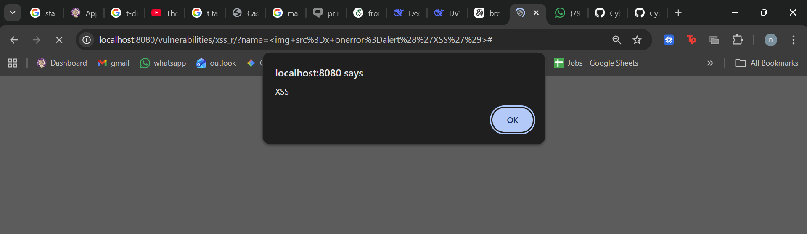
- **Explanation (why it worked):**
  - Medium security filters or blocks basic `<script>` tags but does not properly sanitize event handlers such as `onerror`.
  - By using an `` tag with a broken `src` and an `onerror` handler, the attacker can still execute JavaScript when the image fails to load.
  - The basic `<script>alert('XSS')</script>` payload fails at this level because the application removes or blocks `<script>` tags but misses other injection vectors.

#### High Security Level
- **Payload Used:**

```html
<script>alert('XSS')</script>
```
- **Result:** No alert popup appears and the page loads normally.
- 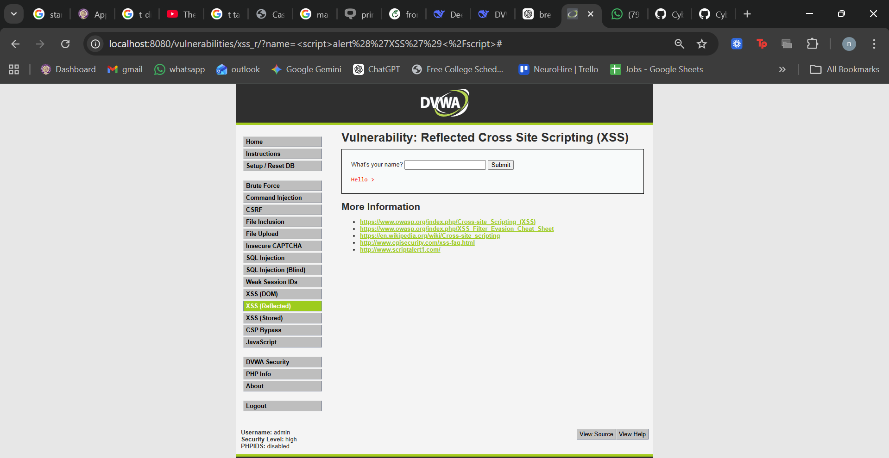
- **Explanation (why it failed):**
  - At High security, the application applies stronger input validation and output encoding.
  - Special characters and HTML/script content are sanitized or encoded before being rendered in the response.
  - As a result, injected scripts cannot execute and Reflected XSS is effectively blocked.

### Vulnerability 10: Stored Cross Site Scripting (XSS)
**Module:** Stored XSS

#### Low Security Level
- **Payload Used:**

```html
<script>alert('XSS')</script>
```
- **Result:** An alert popup appears after submitting the message and whenever the page reloads.
- 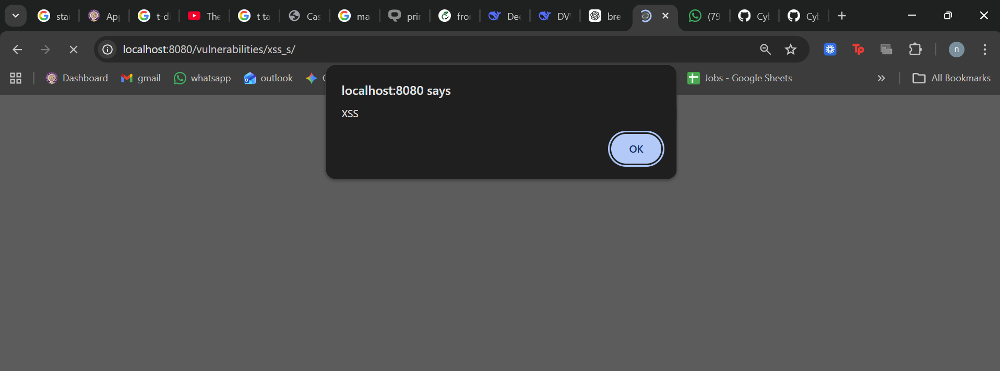
- **Explanation (why it worked):**
  - At Low security, user input is stored in the database and later rendered on the page without sanitization or encoding.
  - When the guestbook or comment page is loaded, the stored `<script>` tag is output as HTML and executed by the browser.
  - This means any visitor to the page triggers the malicious script, demonstrating a persistent (stored) XSS vulnerability.

#### Medium Security Level
- **Payload Used:**

```html

```
- **Result:** The alert popup appears when the stored message loads.
- 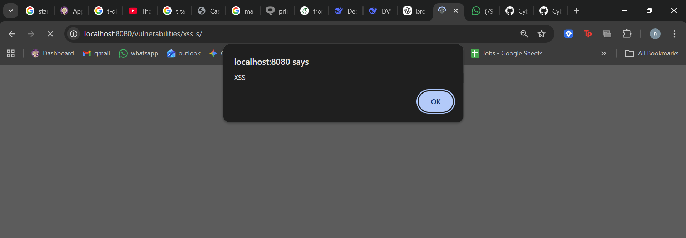
- **Explanation (why it worked):**
  - Medium security filters `<script>` tags but does not block event handlers such as `onerror` on other HTML elements.
  - The malicious `` tag is stored in the database and rendered back to the page as-is.
  - When the browser attempts to load the broken image, the `onerror` handler fires and executes the injected JavaScript.

#### High Security Level
- **Payload Used:**

```html

```
- **Result:** The alert popup still appears when the page loads.
- 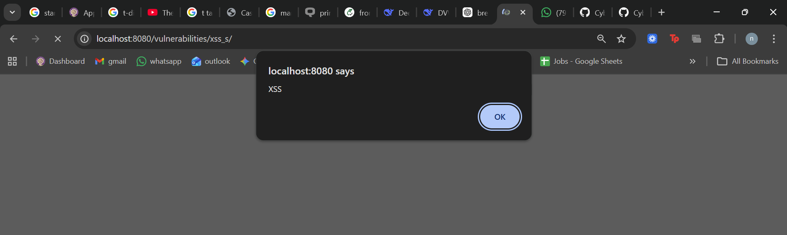
- **Explanation (why protection failed):**
  - Although High security applies stronger filtering, it still does not fully sanitize or encode stored content before displaying it.
  - The malicious HTML with the `onerror` handler is saved in the database and later rendered in the page, so the browser continues to execute the JavaScript.
  - A robust defense would apply strict server-side validation and output encoding to all stored user content to prevent stored XSS.

### Vulnerability 11: Content Security Policy (CSP) Bypass
**Module:** CSP Bypass

#### Low Security Level
- **Payload Used:**  
  `alert("CSP Bypass")`
- **Result:** A browser alert box displaying **“CSP Bypass”** appeared, confirming that the JavaScript executed successfully.
- 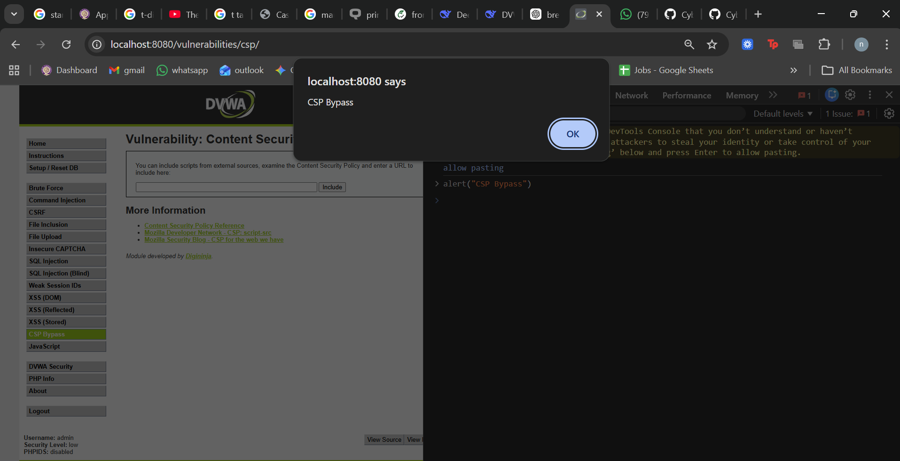
- **Explanation (why it worked):**
  - At the Low security level, the Content Security Policy configuration is very permissive.
  - The application allows scripts from user-controlled or external sources without strict restrictions, so the injected JavaScript is executed directly by the browser.
- **Why this fails at higher levels:**
  - At higher security levels, the CSP configuration becomes stricter by limiting where scripts can be loaded from, reducing the ability to directly inject and execute arbitrary scripts.

#### Medium Security Level
- **Payload Used:**  
  `https://code.jquery.com/jquery-3.6.0.min.js`
- **Result:** The external JavaScript file was successfully loaded and executed within the page.
- 
- **Explanation (why it worked):**
  - At the Medium security level, the CSP policy restricts some script sources but still allows scripts from certain trusted domains, such as common CDNs.
  - By providing a script URL from one of these allowed domains, the browser accepts and loads the script, showing that the policy can still be bypassed through whitelisted sources.
- **Why this fails at higher level:**
  - At the High security level, the policy becomes more restrictive and blocks scripts from most external domains, preventing attackers from simply loading external JavaScript from trusted CDNs.

#### High Security Level
- **Payload Used:**  
  `../vulnerabilities/csp/source/jsonp.php`
- **Result:** The application successfully executed JavaScript by loading code through the JSONP endpoint on the same server.
- 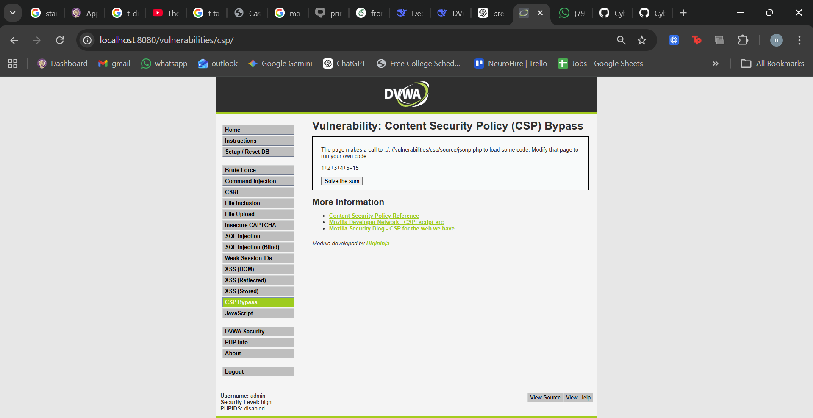
- **Explanation (why it worked):**
  - At the High security level, the CSP policy blocks external scripts but still allows scripts from the same domain.
  - By referencing a JSONP endpoint hosted on the same server, the attacker can cause the application to return and execute attacker-influenced JavaScript while still complying with the CSP rules.
- **Why this remains weaker than ideal:**
  - Compared with the lower security levels, High significantly restricts external script sources.
  - However, because same-origin resources are still permitted, insecure JSONP endpoints or similar mechanisms can still be abused to execute malicious scripts if they are not properly secured.

### Vulnerability 12: JavaScript Attacks
**Module:** JavaScript

#### Low Security Level
- **Payload Used:**

```text
success
```
- **Result:** The application returned **“Invalid token.”**
- 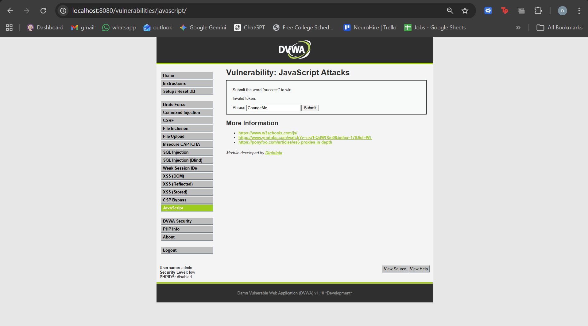
- **Explanation (why it failed):**
  - At Low security, validation is performed through client-side JavaScript. The page expects a token that is generated from the phrase before submission.
  - Because the correct token was not generated by the client-side script (e.g., the user only entered the phrase without triggering token generation), the server rejected the request.
  - Even though the phrase was correct, the missing or wrong token caused the submission to fail.

#### Medium Security Level
- **Payload Used:**

```text
success
```
- **Result:** The application returned **“Well done!”**
- 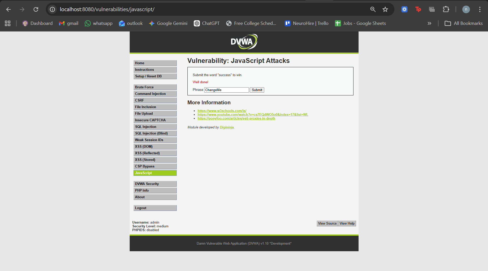
- **Explanation (why it worked):**
  - At Medium security, the JavaScript generates a token using logic such as `reverse("XX" + phrase + "XX")`.
  - For the phrase `success`, the generated token becomes `XXsseccusXX`.
  - Because the correct token was automatically generated in the browser when the phrase was entered, the application accepted the submission.
  - This level still relies entirely on client-side JavaScript for validation; an attacker can inspect the script in developer tools and replicate the token generation to bypass the check.

#### High Security Level
- **Payload Used:**

```text
success
```
- **Result:** The application returned **“Invalid token.”**
- 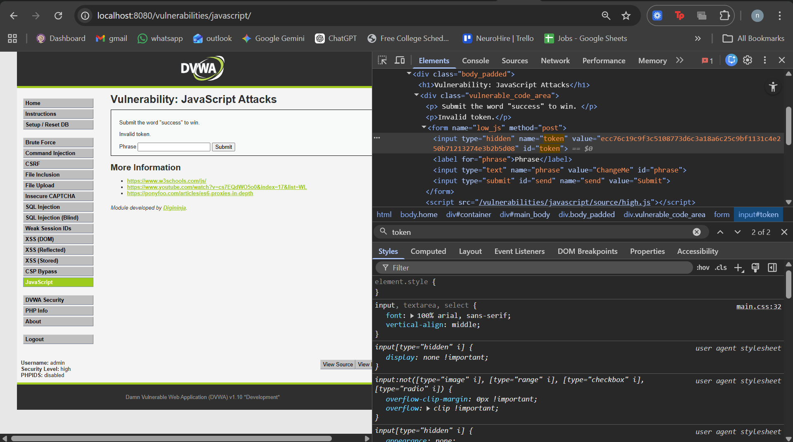
- **Explanation (why it failed):**
  - At High security, the application generates a hashed token using JavaScript before submission. The token is stored in a hidden field and must match the expected server-side value.
  - Simply entering the phrase `success` without the correct token (computed by the hashing function in the client script) results in an invalid submission.
  - Although stronger than Medium, the token-generation logic is still visible in client-side code and could theoretically be reproduced by an attacker who analyzes the script; a robust design would perform token generation and validation only on the server.
### Vulnerability 13: Insecure CAPTCHA
**Module:** Insecure CAPTCHA

#### Low Security Level
- **Payload Used:** Modify the hidden `step` parameter:
  - Original: `<input type="hidden" name="step" value="1">`
  - Modified request: `step=2`
- **Result:** The password was successfully updated **without** solving the CAPTCHA challenge.
- 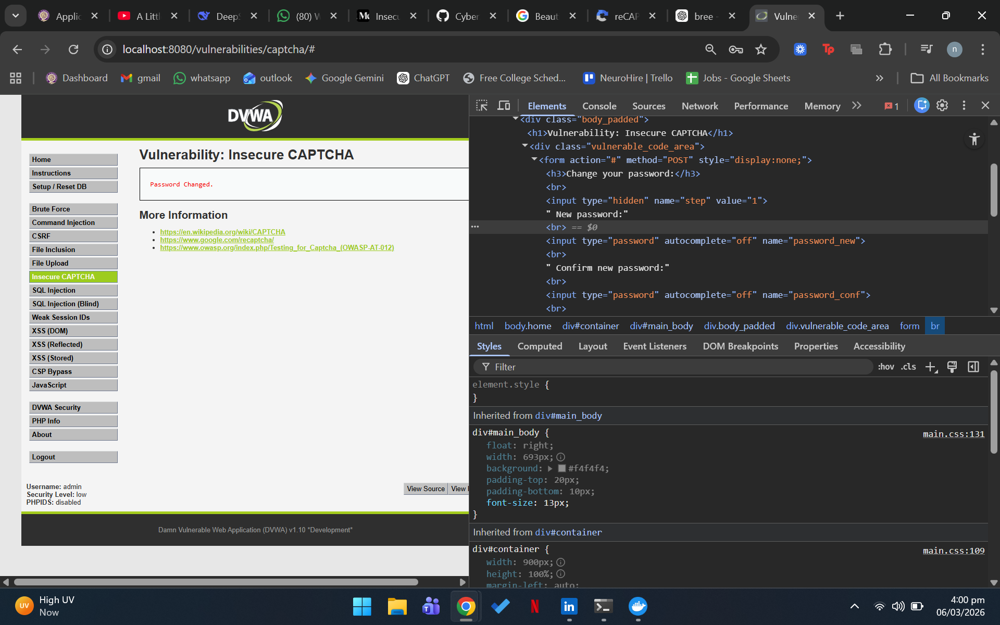
- **Explanation (why it worked):**
  - At Low security, CAPTCHA verification is split into two stages controlled by a `step` parameter.
  - The server checks only whether `step=2`, but does **not** verify that the CAPTCHA from step 1 was actually solved.
  - Because `step` is fully client-controlled, an attacker can submit `step=2` directly and bypass the CAPTCHA flow entirely.
- **Why this fails at higher levels:**
  - Higher security adds additional checks that are meant to confirm the CAPTCHA was completed before allowing the password update.

#### Medium Security Level
- **Payload Used:** Modify two hidden parameters in the request:
  - `step=2`
  - `passed_captcha=true`
- **Result:** The password was changed successfully without solving the CAPTCHA.
- 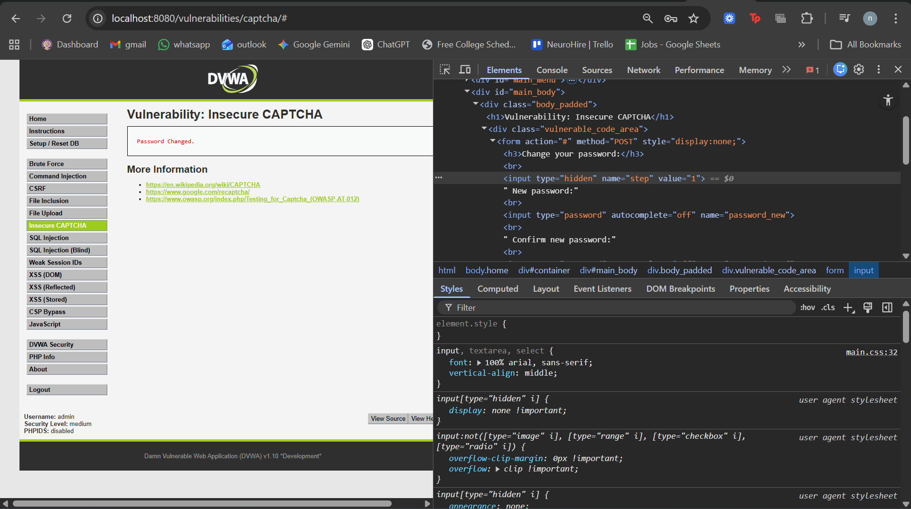
- **Explanation (why it worked):**
  - Medium security introduces a `passed_captcha` flag intended to track whether the CAPTCHA was solved.
  - However, this flag is still supplied by the client and is not robustly validated server-side.
  - An attacker can simply set `step=2` and `passed_captcha=true`, causing the application to assume the CAPTCHA was completed.
- **Why this fails at higher levels:**
  - In the high security configuration, the application is intended to stop trusting simple client-side flags such as `step` or `passed_captcha` and instead validate the CAPTCHA response more strictly.

#### High Security Level
- **Payload Used:** Special CAPTCHA value and header:
  - `g-recaptcha-response=hidd3n_valu3`
  - `User-Agent: reCAPTCHA`
- **Result:** The password was changed successfully even though the CAPTCHA challenge was not solved.
- 
- **Explanation (why it worked / why protection failed):**
  - High security attempts to strengthen validation by checking the CAPTCHA response and some request headers.
  - Due to leftover development logic, the server contains a hidden condition that accepts the special value `hidd3n_valu3` when the request has `User-Agent: reCAPTCHA`.
  - This backdoor-style check lets attackers bypass the real CAPTCHA verification and change the password without solving the challenge.

### Vulnerability 14: Brute Force (SQL Injection Authentication Bypass)
**Module:** Brute Force / Login

#### Low Security Level
- **Payload Used:**
  - **Username:** `admin' OR '1'='1`
  - **Password:** `randompassword`
- **Result:** Login was successfully bypassed. The application displayed:  
  `Welcome to the password protected area admin' OR '1'='1` and granted access to the protected page.
- 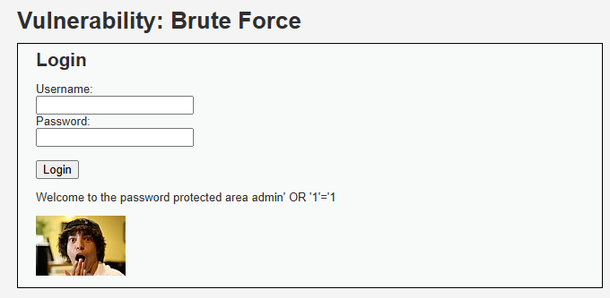
- **Explanation (why it worked):**
  - At Low security, user input is inserted directly into the SQL query without filtering or validation.
  - The payload `admin' OR '1'='1` injects a condition that always evaluates to true in the `WHERE` clause.
  - As long as any row is returned (e.g., the `admin` user), the application treats the login as successful even with an incorrect password.

#### Medium Security Level
- **Payload Used:**
  - **Username:** `admin' OR '1'='1`
  - **Password:** `test`
- **Result:** The injection attempt fails and the application returns:  
  `Username and/or password incorrect.`
- 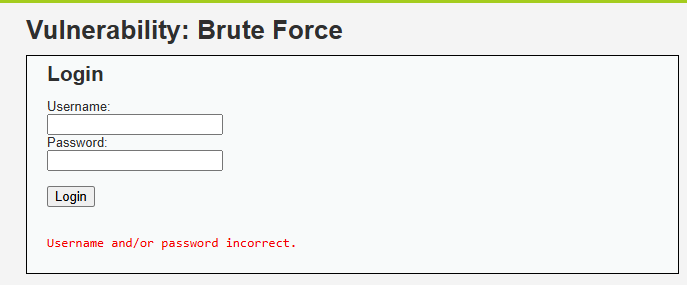
- **Explanation (why it worked at lower level but not here):**
  - Under Low security, the authentication query is built by directly concatenating unsanitized username and password into the SQL.
  - At Medium security, the application starts sanitizing input, for example using `mysql_real_escape_string` or similar escaping.
  - Special characters like quotes are escaped, so the payload no longer breaks out of the string literal or injects extra SQL, preventing the bypass.

#### High Security Level
- **Payload Used:**
  - **Username:** `admin' OR '1'='1`
  - **Password:** `test`
- **Result:** The login attempt still fails and the application again returns:  
  `Username and/or password incorrect.`
- 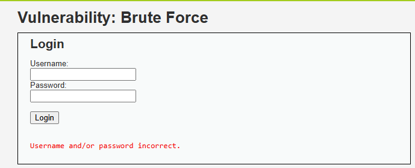
- **Explanation (why it failed at high security):**
  - At High security, stronger defensive measures are applied, such as stricter input validation and use of parameterized queries.
  - User-supplied data is bound as parameters instead of being concatenated into the SQL string, so injected fragments like `OR '1'='1` are treated as data, not executable SQL.
  - Additional protections such as rate limiting or delays between login attempts further reduce the effectiveness of brute force and automated guessing attacks.

---

## Additional Questions (DVWA Environment)

### Q1. Where application files are stored

From the container shell command (see screenshots at the end):

```bash
docker exec -it dvwa /bin/bash
ls /var/www/html
```

The output lists files such as:

- `about.php`
- `login.php`
- `index.php`
- `setup.php`
- `security.php`
- `vulnerabilities/`
- `php.ini`

This shows that the DVWA web application files are stored inside the container at:

`/var/www/html`

This is the default Apache web root directory where PHP web applications are hosted.

### Q2. What backend technology DVWA uses

The Docker logs (see screenshots) show:

```text
Starting MariaDB database server: mysqld
Starting Apache httpd web server: apache2
```

This indicates that DVWA uses:

- **Apache2** – web server  
- **MariaDB/MySQL** – database server

From the file listing:

- `login.php`
- `index.php`
- `setup.php`
- `php.ini`

These files confirm the application is written in **PHP**.

Therefore DVWA uses the following backend stack:

- **Web Server:** Apache2  
- **Server-side language:** PHP  
- **Database:** MariaDB (MySQL compatible)  

This is a classic **LAMP**-style stack.

### Q3. How Docker isolates the environment

The screenshots (listed below) demonstrate Docker isolation in several ways.

1. **Separate container environment**
   - `docker ps` shows the DVWA container:
     - **IMAGE:** `vulnerables/web-dvwa`  
     - **NAME:** `dvwa`  
     - **PORTS:** `8080 -> 80`
   - The application runs inside this container rather than directly on the host OS.

2. **Isolated filesystem**
   - Using:
     ```bash
     docker exec -it dvwa /bin/bash
     ```
   - You enter the container’s own filesystem containing paths like:
     - `/var/www/html`
     - `/var/log/apache2`
   - This filesystem is isolated from the host and only visible inside the container.

3. **Network isolation**
   - Logs show an internal Docker address such as:
     - `172.17.0.2`
   - Docker creates a virtual internal network for containers, separating their traffic from the host network.

4. **Port mapping**
   - From `docker ps`:
     - `0.0.0.0:8080 -> 80/tcp`
   - Port 80 inside the container (Apache) is mapped to port 8080 on the host.
   - You access DVWA via `http://localhost:8080` while the web server stays inside the container.

### Environment Screenshots

- ``
- ``
- ``
- ``
---

## Security Analysis Questions

### 1. Why does SQL Injection succeed at Low security?

SQL Injection succeeds at Low security because the application directly concatenates unsanitized user input into SQL queries. As documented for Vulnerability 3 (SQL Injection) and Vulnerability 14 (Brute Force):

- The backend query is constructed like:  
  `SELECT first_name, last_name FROM users WHERE user_id = '$id';`
- With the payload `1' OR '1'='1`, the query becomes:  
  `SELECT first_name, last_name FROM users WHERE user_id='1' OR '1'='1';`
- Because `'1'='1'` is always true, the condition matches every row in the database.
- No input validation or sanitization is performed on the `id` (or username/password) parameters before they are inserted into the query.
- The application fully trusts user input, allowing attackers to modify the query structure by injecting SQL syntax.

### 2. What control prevents it at High?

At High security, several controls combine to prevent SQL Injection:

1. **Parameterized queries / prepared statements** – User input is bound as parameters instead of being concatenated into the SQL string, so input is always treated as data and not executable code.  
2. **Strict input validation** – Inputs such as IDs are selected from fixed options (e.g., dropdowns) instead of arbitrary free text, reducing the attack surface.  
3. **Server-side validation** – Even if client-side controls are bypassed, the server enforces that only expected values are processed.  
4. **Defense-in-depth** – Multiple layers (validation, parametrization, least privilege) ensure that even if one control fails, others still prevent exploitation.

### 3. Does HTTPS prevent these attacks? Why or why not?

**No – HTTPS does not prevent these attacks.**

- HTTPS only encrypts data **in transit** between the client and the server.
- It protects against **man-in-the-middle (MitM)** eavesdropping and tampering on the network.
- It does **not** validate or sanitize user input on the server.
- The vulnerabilities are in the **application code** (SQL Injection, XSS, CSRF, etc.), not in the transport layer.
- An attacker can still:
  - Submit malicious payloads through the normal web interface over HTTPS.
  - Use tools like Burp Suite to modify and replay requests, even when the connection is encrypted.

HTTPS helps protect credentials and session cookies from being sniffed, but it does **not** stop injection attacks or broken access controls.

### 4. What risks exist if this application is deployed publicly?

If DVWA in its current state were exposed to the internet, it would carry severe risks:

| Risk Category | Specific Threats |
|--------------|------------------|
| **Data Breach** | Extraction of entire user database via SQL Injection; reading sensitive system files via LFI; credential theft. |
| **Account Takeover** | CSRF changing admin passwords; weak session IDs enabling session hijacking; brute-force login attacks. |
| **Remote Code Execution (RCE)** | Command Injection giving full shell access; File Upload web shells; complete server compromise. |
| **Malware Distribution** | Stored XSS injecting malicious JavaScript for all visitors; drive‑by downloads; hosting malware on the server. |
| **Reputation / Legal Impact** | Site defacement; loss of user trust; legal and regulatory consequences from data breaches. |
| **Lateral Movement** | Using the compromised server as a pivot into internal networks or other systems. |

### 5. Map each vulnerability to its OWASP Top 10 category

Using OWASP Top 10:

| Vulnerability | OWASP Category | Category Name |
|---------------|----------------|---------------|
| Command Injection | **A03** | Injection |
| File Inclusion (LFI) | **A05** | Security Misconfiguration |
| SQL Injection | **A03** | Injection |
| CSRF | **A01** | Broken Access Control |
| File Upload | **A05** | Security Misconfiguration |
| SQL Injection (Blind) | **A03** | Injection |
| Weak Session IDs | **A02** | Cryptographic Failures |
| DOM XSS | **A03** | Injection |
| Reflected XSS | **A03** | Injection |
| Stored XSS | **A03** | Injection |
| CSP Bypass | **A05** | Security Misconfiguration |
| JavaScript Attacks | **A04** | Insecure Design |
| Insecure CAPTCHA | **A07** | Identification and Authentication Failures |
| Brute Force | **A07** | Identification and Authentication Failures |

Below is a **clean Markdown answer** you can paste directly into your `.md` file. I included **placeholders for your screenshots** and kept explanations concise for a lab report.

---

# Bonus Task: DVWA Behind Nginx Reverse Proxy with HTTPS

## 1. Reverse Proxy Deployment with Nginx

To improve the architecture and security of the DVWA environment, the application was deployed behind an **Nginx reverse proxy**. In this setup, Nginx acts as an intermediary between the client (browser) and the DVWA container.

Instead of users accessing the DVWA container directly, requests are first received by Nginx. The proxy then forwards these requests to the DVWA web server running inside another Docker container.

The environment therefore follows this architecture:

```
Browser → Nginx Reverse Proxy → DVWA Container
```

This setup allows centralized traffic control and enables additional security features such as HTTPS encryption.

---

## 2. Nginx Reverse Proxy Configuration

The reverse proxy was configured using the following **Nginx configuration file (`nginx.conf`)**.

```
events {}

http {

    server {
        listen 80;

        location / {
            proxy_pass http://dvwa:80;
        }
    }

    server {
        listen 443 ssl;

        ssl_certificate /etc/nginx/certs/dvwa.crt;
        ssl_certificate_key /etc/nginx/certs/dvwa.key;

        location / {
            proxy_pass http://dvwa:80;
        }
    }

}
```

### Configuration Explanation

* `listen 80` allows Nginx to accept **HTTP traffic**.
* `listen 443 ssl` enables **HTTPS communication** using SSL/TLS.
* `proxy_pass http://dvwa:80` forwards incoming requests to the DVWA container running on port 80.
* `ssl_certificate` and `ssl_certificate_key` define the **self-signed certificate** used for HTTPS encryption.

---

## 3. HTTPS Implementation with Self-Signed Certificate

To enable encrypted communication, a **self-signed SSL certificate** was generated and mounted into the Nginx container.

The certificate files used were:

```
dvwa.crt
dvwa.key
```

These files were placed inside the Nginx container at:

```
/etc/nginx/certs
```

Once configured, Nginx was able to serve DVWA securely over **HTTPS (port 443)**.

---

## 4. Container Deployment Verification

The following command was used to confirm that both containers were running correctly:

```
docker ps
```

This showed two active containers:

* **dvwa** – running the vulnerable web application
* **nginx-dvwa** – acting as the reverse proxy


```
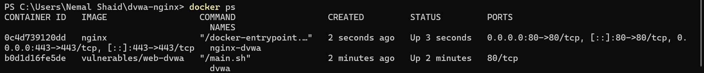
```

---

## 5. Accessing DVWA via HTTP

After deployment, the DVWA login page was successfully accessed through HTTP using:

```
http://localhost
```

This request was received by Nginx and forwarded to the DVWA container.


---

## 6. Accessing DVWA via HTTPS

DVWA was also accessed through HTTPS using:

```
https://localhost
```

Because a **self-signed certificate** was used, the browser displayed a warning indicating that the certificate authority is not trusted. After proceeding past the warning, the DVWA login page loaded successfully over an encrypted connection.


- 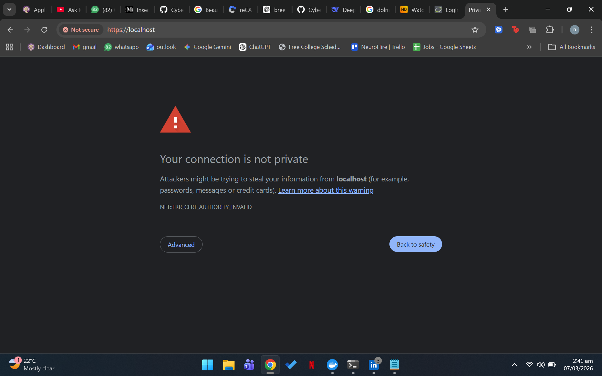

- 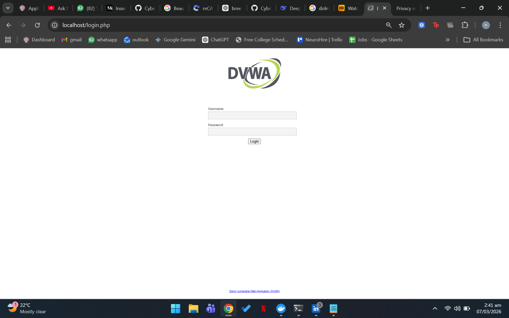


---

## 7. Difference Between HTTP and HTTPS Traffic

| Feature           | HTTP                        | HTTPS                                  |
| ----------------- | --------------------------- | -------------------------------------- |
| Protocol          | HyperText Transfer Protocol | HyperText Transfer Protocol Secure     |
| Encryption        | No encryption               | Uses SSL/TLS encryption                |
| Data Transmission | Plain text                  | Encrypted                              |
| Default Port      | 80                          | 443                                    |
| Security          | Vulnerable to interception  | Protects confidentiality and integrity |

### Explanation

HTTP sends data between the browser and server in **plain text**, meaning attackers could intercept sensitive information such as login credentials. HTTPS adds a **TLS encryption layer**, which encrypts all transmitted data. This ensures that communication between the client and server remains secure and cannot be easily intercepted or modified.


# Conclusion

This comprehensive security assessment of the Damn Vulnerable Web Application (DVWA) has demonstrated the critical importance of implementing proper security controls throughout the software development lifecycle. Through systematic testing across Low, Medium, and High security levels, we have observed how inadequate input validation, weak authentication mechanisms, and insecure configurations can lead to severe vulnerabilities that compromise the confidentiality, integrity, and availability of web applications.

